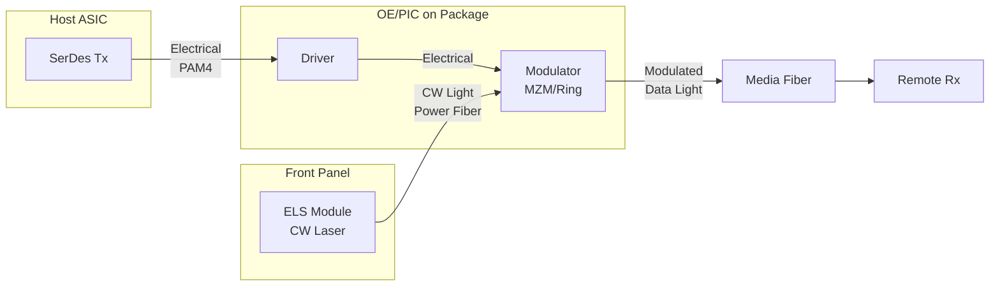
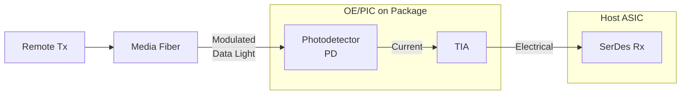
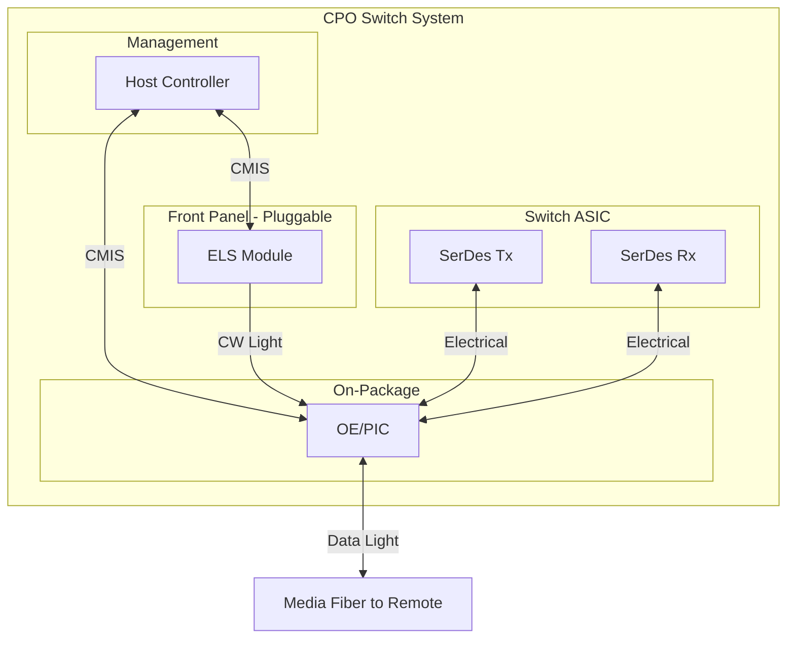

# CPO Switch Architecture Summary

## Overview

In Co-Packaged Optics (CPO) switch architecture, the **ELS (External Light Source)** provides continuous wave (CW) light exclusively to the **Tx path**. The Rx path operates independently without requiring the local ELS.

---

## Key Concepts

| Term | Definition |
|------|------------|
| **CPO** | Co-Packaged Optics - optical engine integrated on switch package |
| **ELS** | External Light Source - provides CW laser light |
| **CW** | Continuous Wave - unmodulated, stable carrier light |
| **OE/PIC** | Optical Engine / Photonic IC - contains modulators and photodetectors |
| **Power Fiber** | Delivers CW light from ELS to OE (Tx only) |
| **Media Fiber** | Carries modulated data light between endpoints |

---

## Tx Architecture

**Tx Signal Flow:**
1. ASIC SerDes generates baseband electrical signal
2. Driver amplifies signal to OE modulator
3. ELS provides CW light via power fiber
4. Modulator imprints data onto CW light
5. Modulated data light exits via media fiber

---

## Rx Architecture

**Rx Signal Flow:**
1. Remote Tx sends modulated data light
2. Media fiber delivers light to local OE
3. Photodetector converts light to current
4. TIA amplifies and converts to voltage
5. SerDes Rx processes electrical signal

---

## Complete System View

---

## ELS Role Summary

| Aspect | Tx Path | Rx Path |
|--------|---------|---------|
| **Uses ELS?** | Yes | No |
| **Light Source** | CW from ELS | Data light from remote |
| **OE Function** | Modulator | Photodetector + TIA |
| **Fiber Type** | Power + Media | Media only |

---

## Key Takeaways

- ELS outputs **CW light** (carrier) with no data modulation
- CW light flows only to **Tx modulators** via power fiber
- Rx uses **incoming data light** from remote, independent of local ELS
- Host controller manages both ELS and OE via **CMIS protocol**
- Separating laser (ELS) from package improves **thermal management** and **serviceability**
