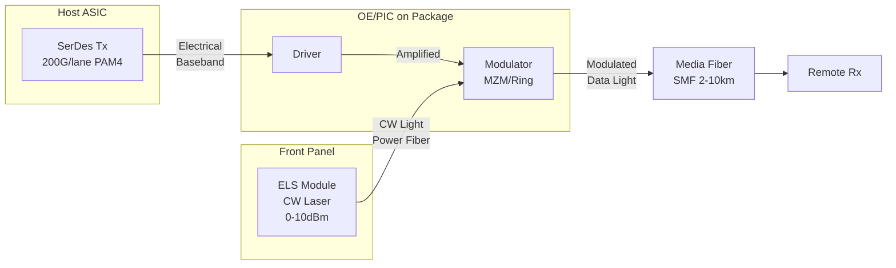
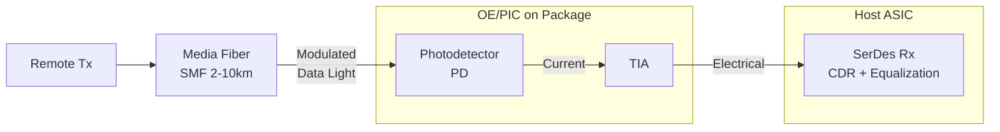
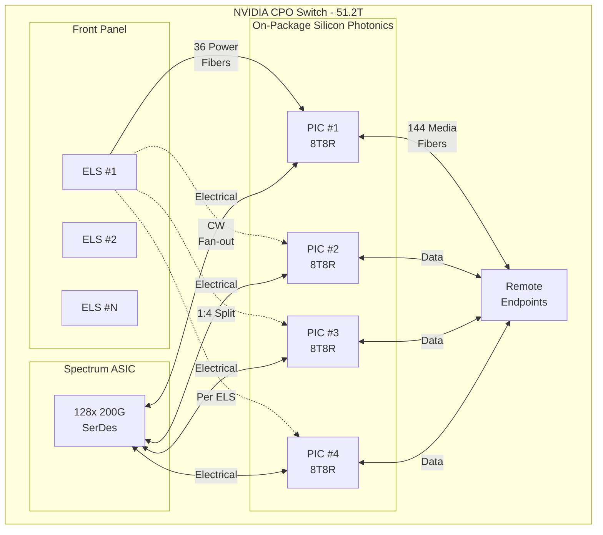
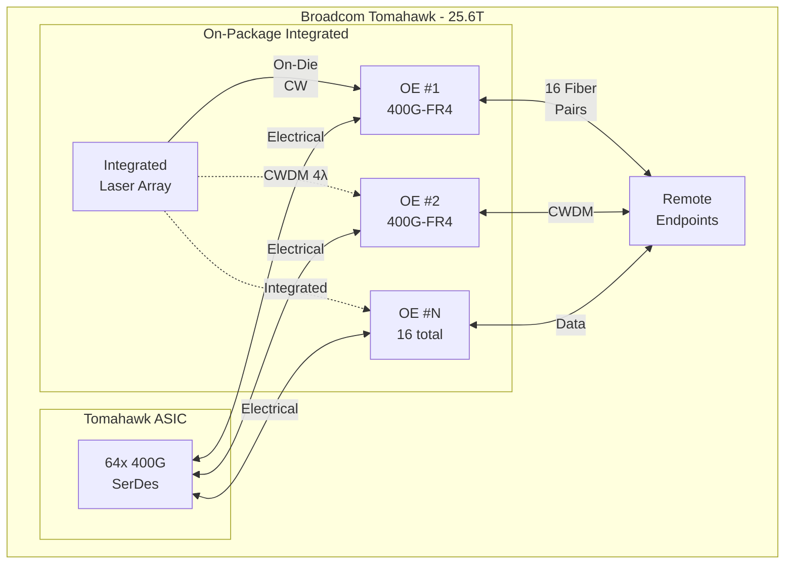
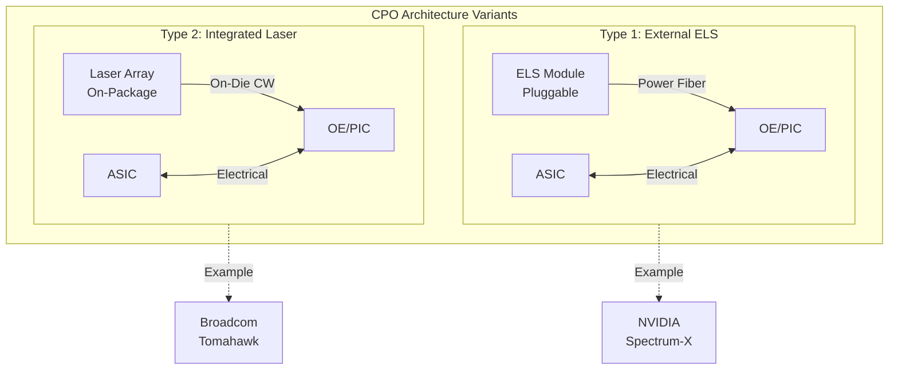

# CPO Switch Architecture Summary with Real Examples

## Overview

In Co-Packaged Optics (CPO) switch architecture, the **ELS (External Light Source)** provides continuous wave (CW) light exclusively to the **Tx path**. The Rx path operates independently without requiring the local ELS.

---

## Key Concepts

| Term | Definition |
|------|------------|
| **CPO** | Co-Packaged Optics - optical engine integrated on switch package |
| **ELS** | External Light Source - provides CW laser light |
| **CW** | Continuous Wave - unmodulated, stable carrier light |
| **OE/PIC** | Optical Engine / Photonic IC - contains modulators and photodetectors |
| **Power Fiber** | Delivers CW light from ELS to OE (Tx only) |
| **Media Fiber** | Carries modulated data light between endpoints |

---

## Tx Architecture

**Tx Signal Flow:**
1. ASIC SerDes generates baseband electrical signal
2. Driver amplifies signal to OE modulator
3. ELS provides CW light via power fiber
4. Modulator imprints data onto CW light
5. Modulated data light exits via media fiber

---

## Rx Architecture

**Rx Signal Flow:**
1. Remote Tx sends modulated data light
2. Media fiber delivers light to local OE
3. Photodetector converts light to current
4. TIA amplifies and converts to voltage
5. SerDes Rx processes electrical signal

---

## Real-World Example: NVIDIA Spectrum-X / Quantum-X

**NVIDIA Configuration:**
- 1 ELS → 4 PICs (8T8R each)
- Each PIC: 8 Tx lanes × 200G = 1.6T
- CW fan-out: 1 CW source → 8 modulators per PIC
- Total: 324 fibers (144 media + 36 laser power)
- Switch capacity: 51.2T

---

## Real-World Example: Broadcom Tomahawk CPO

**Broadcom Configuration:**
- Integrated laser array on package (not external ELS)
- 400G-FR4 per OE (CWDM 4λ)
- 16 fiber-pairs per engine → 6.4T per OE
- Total: 16 OE × 400G = 6.4T per direction
- Switch capacity: 25.6T

---

## Architecture Comparison

| Feature | NVIDIA Spectrum-X | Broadcom Tomahawk |
|---------|-------------------|-------------------|
| **Laser Type** | External ELS (pluggable) | Integrated on-package |
| **PIC Config** | 8T8R per PIC | 400G-FR4 per OE |
| **CW Delivery** | Power fiber (36 fibers) | On-die waveguide |
| **Serviceability** | ELS replaceable | Full package replacement |
| **Thermal** | Laser isolated from ASIC | Laser shares package thermal |
| **Capacity** | 51.2T | 25.6T |

---

## ELS Role Summary

| Aspect | Tx Path | Rx Path |
|--------|---------|---------|
| **Uses ELS?** | Yes (NVIDIA) / Integrated (Broadcom) | No |
| **Light Source** | CW from ELS or on-die laser | Data light from remote |
| **OE Function** | Modulator | Photodetector + TIA |
| **Fiber Type** | Power + Media (NVIDIA) / Media only (Broadcom) | Media only |

---

## Key Takeaways

- **NVIDIA approach**: External ELS allows independent laser thermal management and field replacement
- **Broadcom approach**: Integrated laser simplifies fiber management but requires full package replacement
- Both architectures use CW light **only for Tx path**
- Rx always uses **incoming modulated data light** from remote endpoints
- Choice depends on tradeoffs: serviceability vs integration density
